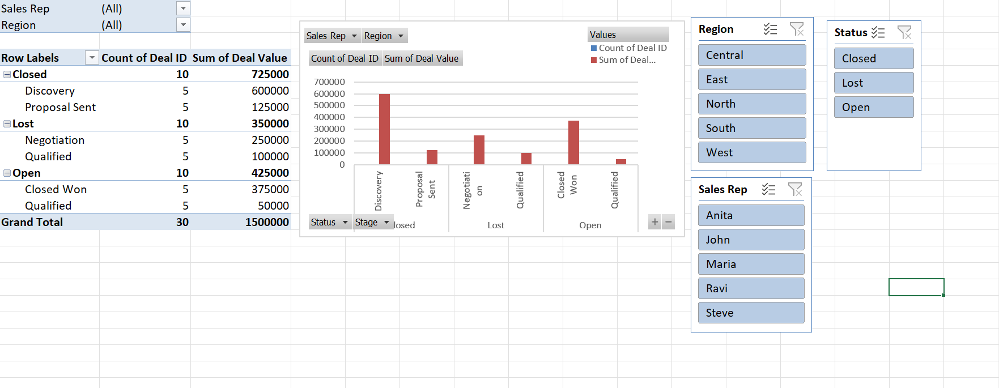

# Sales Opportunity Tracker (Excel Dashboard)

📊 A dynamic sales opportunity tracking tool built in Microsoft Excel using:
- Pivot Tables & Pivot Charts
- KPI Metrics (Total Value, Deal Counts, etc.)
- Conditional Formatting
- VBA Macros (filter high/low value deals)

## 📁 Features

- 📌 Dashboard with interactive filters
- 🔍 One-click macro buttons for deal filtering
- ✅ Summary KPI cards for open/closed deals
- 📈 Pivot charts by sales stage and region

## 📸 Preview

## 🔧 Built With

- Microsoft Excel (.xlsm)
- VBA for macros
- PivotTables, Charts
- Excel formulas and conditional formatting

## 🚀 How to Use

1. Download the `.xlsm` file
2. Enable macros when prompted
3. Use buttons to filter deals
4. View summary KPIs at the top

## 🎓 Skills Demonstrated

- Excel automation
- Business intelligence reporting
- Sales analytics
- VBA scripting
- Dashboard storytelling

---

## 👤 Author

Daivik Nandan Ram  
[LinkedIn](https://www.linkedin.com/in/daiviknandanram) • [GitHub](https://github.com/daivik05)
